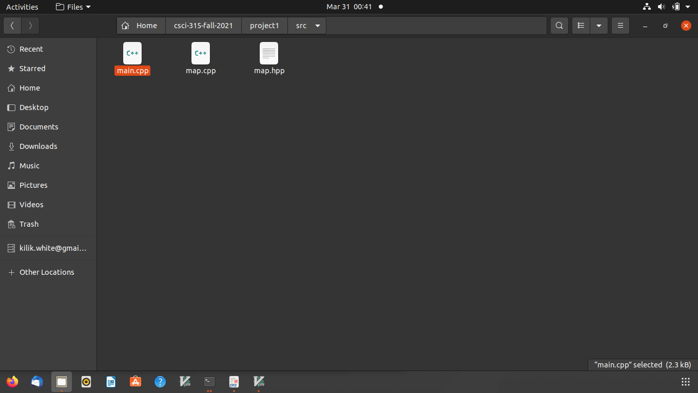
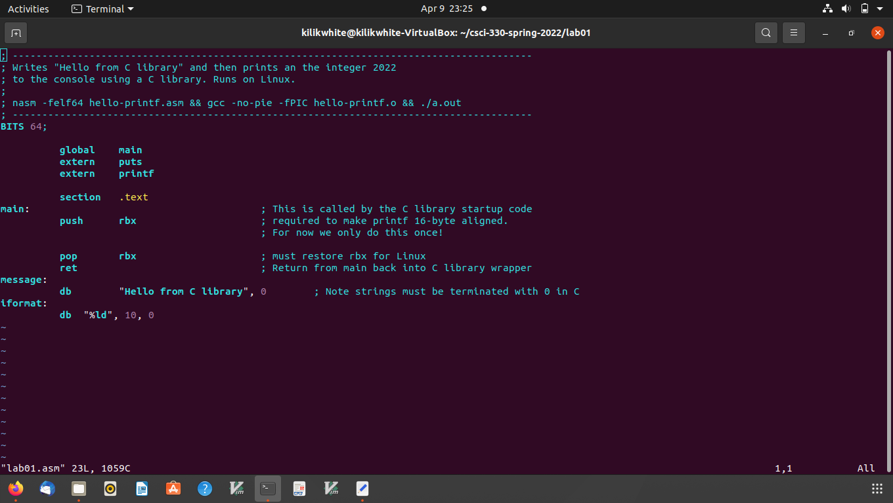
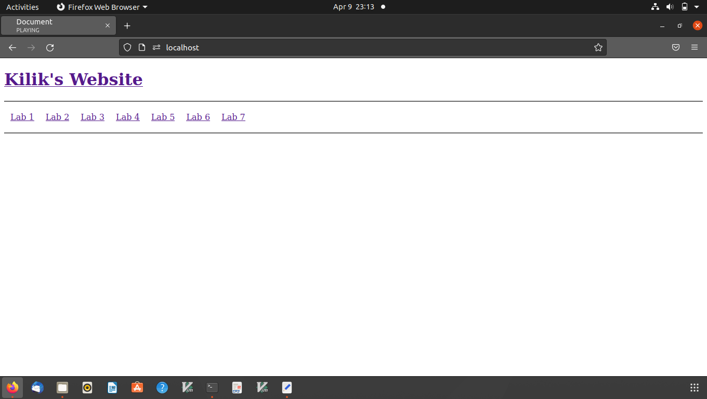
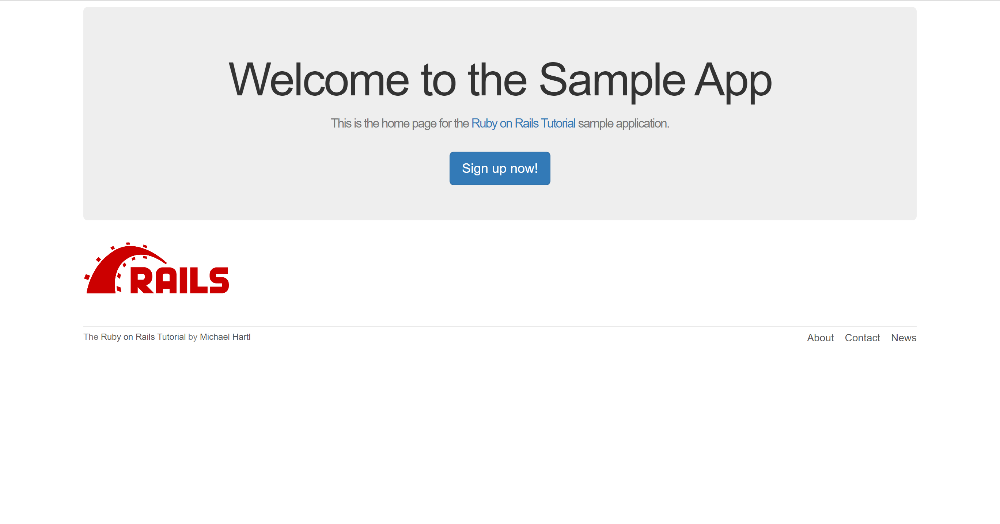

Portfolio
=========
Reflection Questions
--------------------

### [My College Reflection Questions](Reflection)

---
Programming Projects
--------------------

*For access to my private project repositories, please [email me](mailto:kilikwhite@outlook.com?subject=GitHub%20Access) with the subject line, GitHub Access.

---
### [Project 1: Large Map | CSCI 315](project1)

---
### [Assembly Lab 1-Lab 6 Compilation | CSCI 330](project2)

---
### [Applied Networking Website| CSCI 332](project3)

---
### [Sample-app | CSCI 334](project4)

---

Ethics Papers
-------------

### [Necessary Testing](/pdf/Data_Structures_Ethics_Paper_edit.pdf)

-   **Class: Data Structure Analysis CSCI 315-01**  
-   **Grade: A**

### [Agreeance with ACM's Codes](/pdf/Ethic_1(1).pdf)

-   **Class: Systems Analysis & Software Design CSCI 495-40** 
-   **Grade: A**

### [Paper 3 Title](/pdf/sample_presentation.pdf)

-   **Class:** 
-   **Grade:**

---

Presentations
-------------

### [Equifax Data Breach](/pdf/Scripting_Security_Presentation.pdf)

- **Class: Survey of Scripting Languages CSCI 301-40** 
- **Grade: A**

### [Solarwinds Cyberattack](/pdf/Solarwinds_Presentation.pdf)

- **Class: Cyber Defense CSCI 352** 
- **Grade: TBA**

---

Page template forked from <a href="https://github.com/csu-cs/csci-portfolio">CSU-CS</a>

<!-- Remove above link if you don't want to attributive -->
