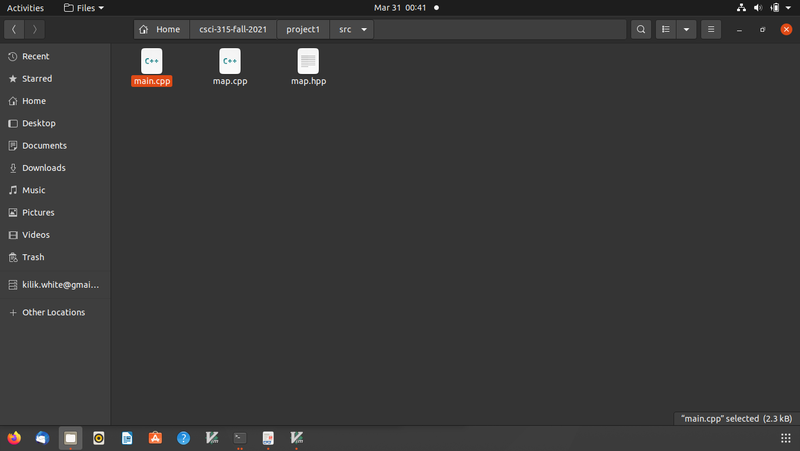

[Back to Portfolio](./)

Project 1: Large Map
===============

-   **Class: Data Structures CSCI 315**
-   **Grade: B-** 
-   **Language(s): C++** 
-   **Source Code Repository:** [features/mastering-markdown](https://github.com/kilikwhite/csci-315-fall-2021/tree/master/project1)  
    (Please [email me](mailto:kilikwhite@outlook.com?subject=GitHub%20Access) to request access.)

## Project description

This project is made for the purpose of speeding up the performance of the search and howmany methods of the key-value search.  The key-value is on storeing a student's name(key) with a value(an integer) and reading the value with the methods.  how-many counts how many words have a specified prefix and the search methods search for the key and stores the value in a specifed value of the method.  The main file test the program, the main goal is to test alot of info at once.

## How to compile and run the program

To run the program first go to the project file via:
cd csci-315-fall-2021/project1

Then type:
make 

After that the code is compliled type:
./map-test

The code should run.

## UI Design

First it will require adding items to the main file under the src folder as shown in Fig 1.  The main file(Fig 2.) needs to be edited with your perfered editior of choice (I am using linux's vim text editior).  Then save the changes and type the command to compile and run the program.  These should be your results(Fig 3. and Fig 4.)

  
Fig 1. This is the contents of the Folder.

  
Fig 2. The main file

  
Fig 3. Results part 1.

  
Fig 4. Results part 2.

## 3. Additional Considerations

Remember you need to be able to run C++ code to run the project so make sure a c++ compiler is on the machine.

For more details see [GitHub Flavored Markdown](https://guides.github.com/features/mastering-markdown/).

[Back to Portfolio](./)
