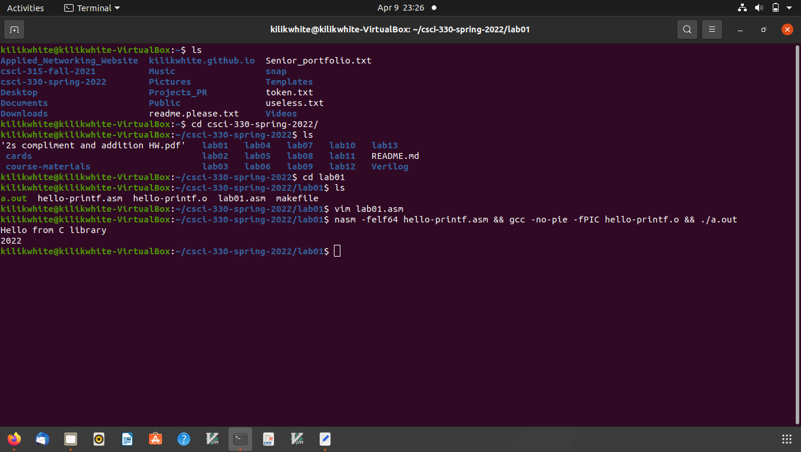

[Back to Portfolio](./)

Assembly Lab 1 - Lab 6
===============

-   **Class:  Computer Archetecture CSCI 330** 
-   **Grade:  TBA** 
-   **Language(s):  Assembly** 
-   **Source Code Repository:** [csci-330-spring-2022](https://github.com/kilikwhite/csci-330-spring-2022)  
    (Please [email me](mailto:kilikwhite@outlook.com?subject=GitHub%20Access) to request access.)

## Project description

This project is more of a compilation of labs 1 though 6 of programming through assembly.  In lab 1, it was an introduction to assembly code.  Labs 2 and 3 worked on summing the values in an array.  And labs 4, 5, and 6 are about making functions via assembly that mirror C.

## How to compile and run the program

To compile the project, first go to the directory of the lab you want to compile.  Next type nasm -felf64 lab0(lab number).asm && gcc -no-pie -fPIC lab0(lab number).o && ./a.out.  If you are compileing lab01 then you need to type this: nasm -felf64 hello-printf.asm && gcc -no-pie -fPIC hello-printf.o && ./a.out.

```bash
cd ./lab0(lab number)
nasm -felf64 lab0(lab number).asm && gcc -no-pie -fPIC lab0(lab number).o && ./a.out
```


## UI Design

The program mainly is shown through a command line.  If the user wants to edit the code, they can open up a text editor and see something similar to Fig 1 where there is alot of code.  Then after you saved the changes to the code then you would type the commands that is shown in How to compile and run the program (Fig 2).  It will output a spicific result that was written within the code.


  
Fig 1. Lab01 Code

  
Fig 2. Example output after input is processed.

## 3. Additional Considerations

To be able to run this, it will require the machine to be able to compile Assembly code so make sure that the machine can run assembly before you can use the website. 


[Back to Portfolio](./)
