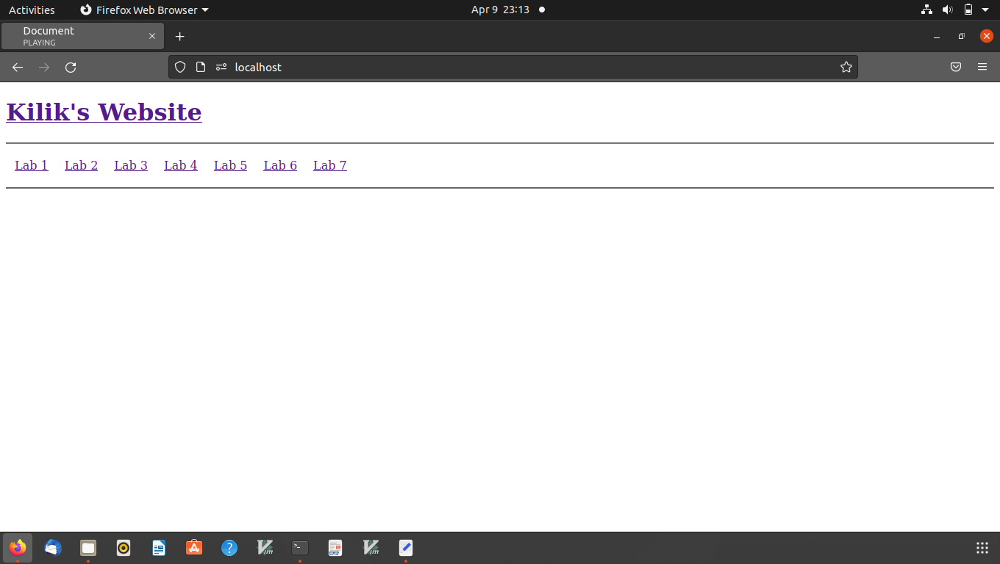

[Back to Portfolio](./)

Applied Networking Website
===============

-   **Class: Applied Networking CSCI 332** 
-   **Grade: A-** 
-   **Language(s): HTML, PHP, & CSS** 
-   **Source Code Repository:** [features/mastering-markdown](https://github.com/kilikwhite/Applied_Networking_Website)  
    (Please [email me](mailto:kilikwhite@.outlook.com?subject=GitHub%20Access) to request access.)

## Project description

This is a running project for Applied Networking which contains a website for the labs that is due.  A huge note on lab5 is that lab5 is where the items and awsners for the partner Activity with Brian Diez was in.  This means that lab5 is a collaberated effort, the rest I did myself.  Labs 1-5 are HTML and CSS while Lab 6 is a mixture of HTML and PHP.


## How to compile and run the program

The way to run the website is a bit complex.  The best way to run the website is via apache servers on linux.

First you need a Virtual Box and Ubuntu 64
Virtual Box link:  https://www.virtualbox.org/
Ubuntu 64 iso download link:  https://ubuntu.com/

Once the linux Virtual Box is installed then go to terminal and start installing both Apache and php:

```bash
sudo apt update
sudo apt install apache2
sudo apt-get install php libapache2-mod-php
```

After both apache and php is installed then (assumeing you cloned everything from my git repository) navigate into the website folder and copy everything into /var/www/html:

```bash
cd Applied_Networking_Website/Website
sudo cp * -R /var/www/html
```

Finally you can see the website via going on Firefox on linux and type on the searchbar: http://localhost

Now you can fully access the website.

## UI Design

Since this is a website there is alot more interaction compared to the previous projects.  The main website's layout is shown in figure 1 which is the home page.  On figure 1, pressing any of the (Lab number) links will navigate the user to the respective labs while pressing on Kilik's Website link will take the user to the home page.  As for navigating through the website clicking on the Lab 1 link will take you to the Lab 1 Index (Fig. 2).  In Lab 6 clicking the links will take you to php pages so make sure that the computer can run php.


  
Fig 1. Website Home Page

  
Fig 2. Lab 1 index page

  
Fig 3. Lab 6 index page

## 3. Additional Considerations

If your machine can't use virtualization, an alternate method is through VS Code but it will require having live server setup but it will not work for php. 

For more details see [GitHub Flavored Markdown](https://guides.github.com/features/mastering-markdown/).

[Back to Portfolio](./)
