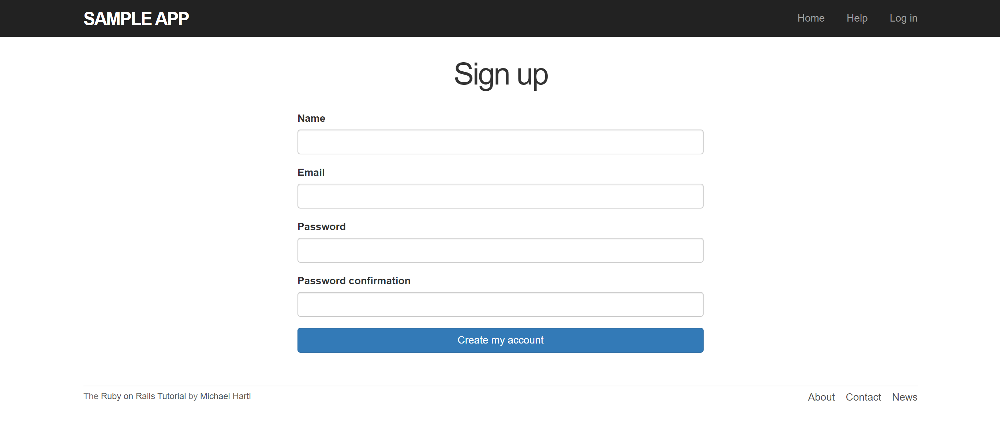
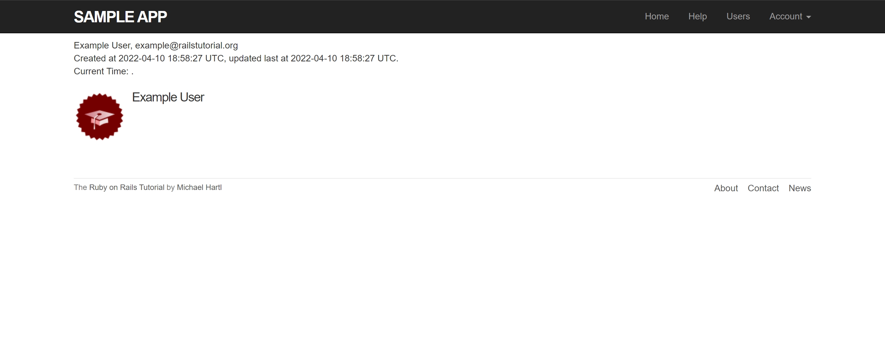
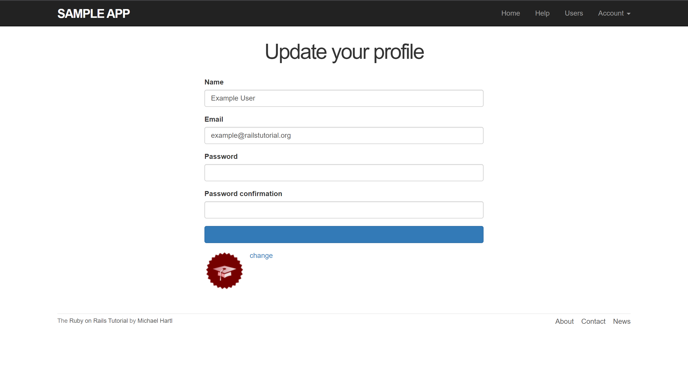
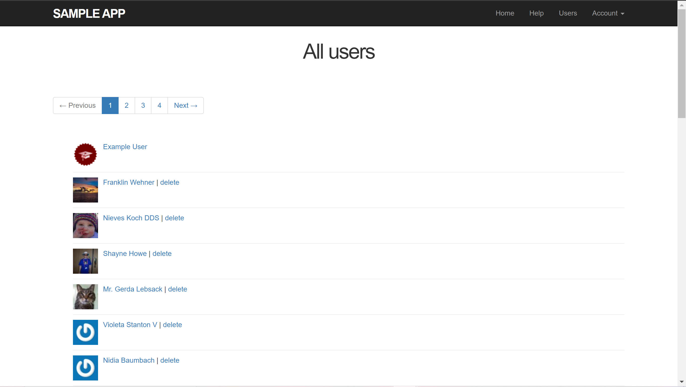
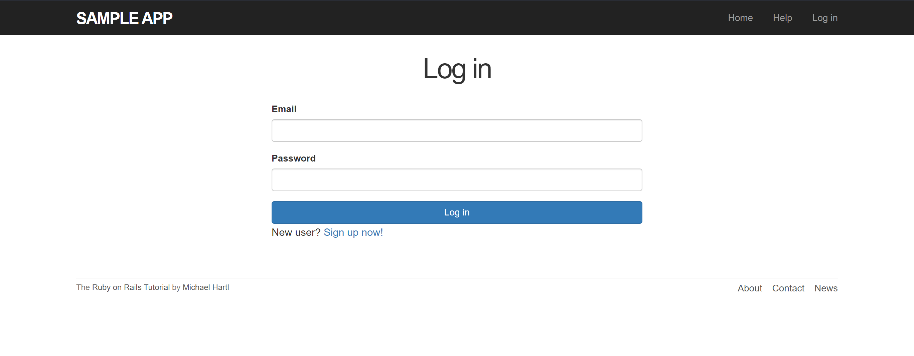

[Back to Portfolio](./)

Sample-app
===============

-   **Class: User-Interface CSCI 334** 
-   **Grade: TBA** 
-   **Language(s):HTML, SCSS, Ruby** 
-   **Source Code Repository:** [sample_app](https://github.com/kilikwhite/sample_app)  
    (Please [email me](mailto:kilikwhite@outlook.com?subject=GitHub%20Access) to request access.)

## Project description

This is a website that was made by following the ruby on rails tutorial for the class.  This website allows the user to make an account, look at all the users of the app, and if an admin, It allows you to delete specific users.  

## How to compile and run the program

Lucky this is already in a heroku app, here is the link.

Link to the [Sample-app](https://morning-everglades-50575.herokuapp.com/)

## UI Design

First it will require clicking on the the link to the sample-app above.  After clicking on the sample app, you will see something like figure 1.  There is alot to try out on the UI, first is if you click on the Sign up now button, the user will go to a page that looks like figure 2.  The user at this point will make an account and be navigated to a page like figure 3 (note I used example user for this).  If the user whill logged in hovers to account and click settings, it will take the user to a page where they can update infomation(figure 4).

The user if logged in, can also see a list of users as shown in figure 5.  Finally if the user logs out, they can log back in via the login page (figure 6.)

  
Fig 1. Home Screen

  
Fig 2. Sign up page.

  
Fig 3. The user page.

  
Fig 4. The update page.

  
Fig 5. A list of users.

  
Fig 6. Login page.

## 3. Additional Considerations

The page is not perfect becasue a fake email layout can work though the images is linked to genuine emails from graveler.  Also consider that this was part of a tutorial and that I did not did any advanced security measures with the login function. 

[Back to Portfolio](./)
